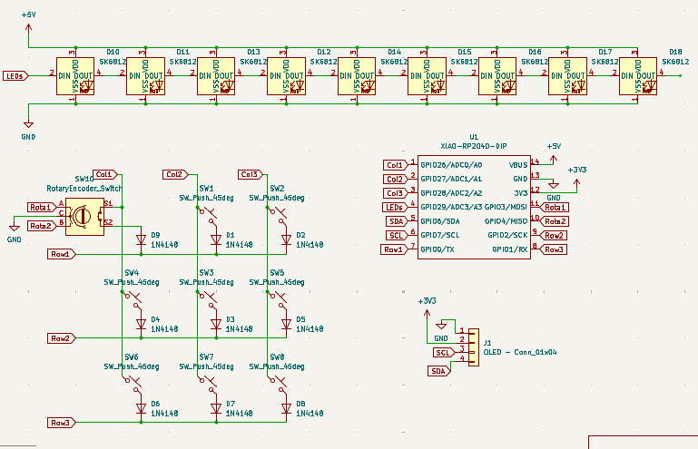

# Starpad - Journal
Here is my journal about my journey making the _starpad_, a DIY macropad! ✨💖

## Research + Schematic (2 hours)

Super excited to start! PS, prior to this (like a couple weeks back) I followed the https://hackpad.hackclub.com/guide to get a feel for how to make this. 
After procrastinating for a couple weeks on various different projects and a trip to the Smokies, here I am!

I looked back over the Hackpad guide, as well as this one: https://wiki.ai03.com/books/pcb-design/page/matrices-and-duplex-matrix
before making a new project on KiCad and diving into making this thing. 

Here is the schematic:

## Routing + Silkscreen (3 hours)

Getting all the wires connected certainly was... something. I had to use more than one via (where you go through the board and jump the wire to the other side. via = lifesaver). After I'd routed everything, I added a bunch of silkscreen art + my name to it. Here's a picture:
