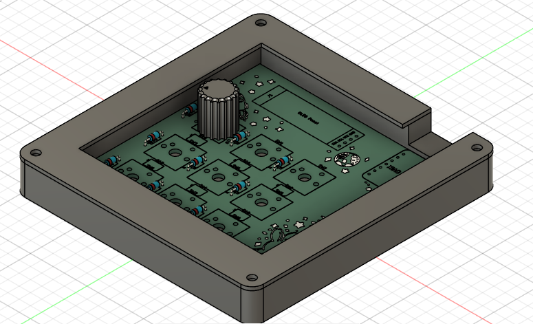

# Starpad - Journal
Here is my journal about my journey making the _starpad_, a DIY macropad! ✨💖

## Research + Schematic (2 hours)

Super excited to start! PS, prior to this (like a couple weeks back) I followed the https://hackpad.hackclub.com/guide to get a feel for how to make this. 
After procrastinating for a couple weeks on various different projects and a trip to the Smokies, here I am!

I looked back over the Hackpad guide, as well as this one: https://wiki.ai03.com/books/pcb-design/page/matrices-and-duplex-matrix
before making a new project on KiCad and diving into making this thing. 

Here is the schematic:

## Routing + Silkscreen (3 hours)

Getting all the wires connected certainly was... something. I had to use more than one via (where you go through the board and jump the wire to the other side. via = lifesaver). After I'd routed everything, I added a bunch of silkscreen art + my name to it. 

Here's a picture:

## CAD (feat. Fusion 360) (2 hours)
In this step, I made the case for the macropad, plus the cover for the rotary encoder. I used Fusion 360 for this, which I have experience with from school. I designed an open case, since I wanted my PCB and silkscreens to be visible.

Here are some pictures of the case and the rotary encoder cover:

And here is what it looks like put together:

## Firmware (1.5 hours)
I used kmk to write the firmware for my hackpad. First I installed some libraries to allow it to work with the rotary encoder and the OLED display. Then I wrote the code to make the keys work, as well as the rotary encoder. Here is the button layout:

| (Rotary Encoder) | Mute/Unmute | Camera Toggle |
|------------------|-------------|---------------|
| Previous Track   | Play/Pause  | Next Track    |
| Screenshot       | RGB Mode 🔄 | Emoji Picker 😊 |

And now I'm done! Well, until my parts come anyway.

To-Do:
- order parts
- solder parts
- assemble macropad
- finish this journal