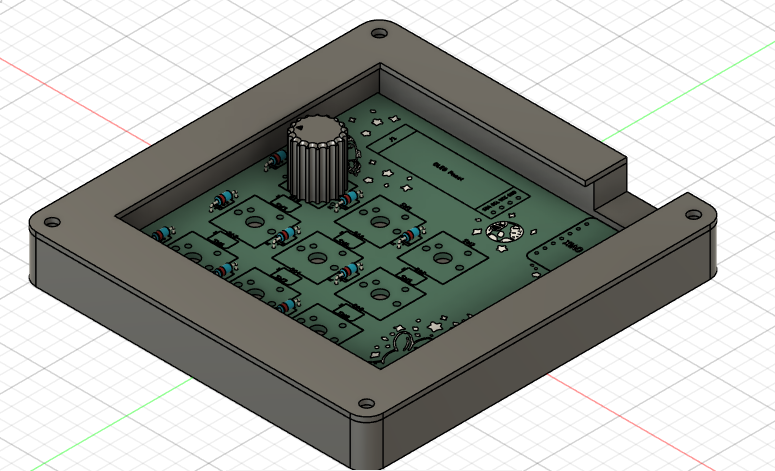

# starpad 🌠
a cute diy macropad!

link to my journal.md: [starpad - journal](JOURNAL.md)

## What is starpad?
Starpad is my DIY macropad! It has 8 buttons, a rotary encoder, and an OLED display. It can control volume, play/pause media, and more! I named it starpad because I wanted to silkscreen stars onto it :)

## Why did I make starpad?
I made starpad for hackpad, and to have a cute + functional macropad. I wanted to learn more about electronics and PCB design on KiCad. (I also used Fusion 360 for the custom case!)

## How did I make starpad?
I made starpad by first designing the schematic in KiCad, then routing the PCB and adding silkscreen art. I designed the case in Fusion 360, procrastinated, and wrote the firmware using kmk.

## Learnings and struggles 🌱
While I'm pretty familiar with KiCad now, I learned about connecting the backlighting LEDs, and how to use a rotary encoder and OLED. This was my first time using kmk, so I learned how to use that to write firmware using the KMK Documentation.